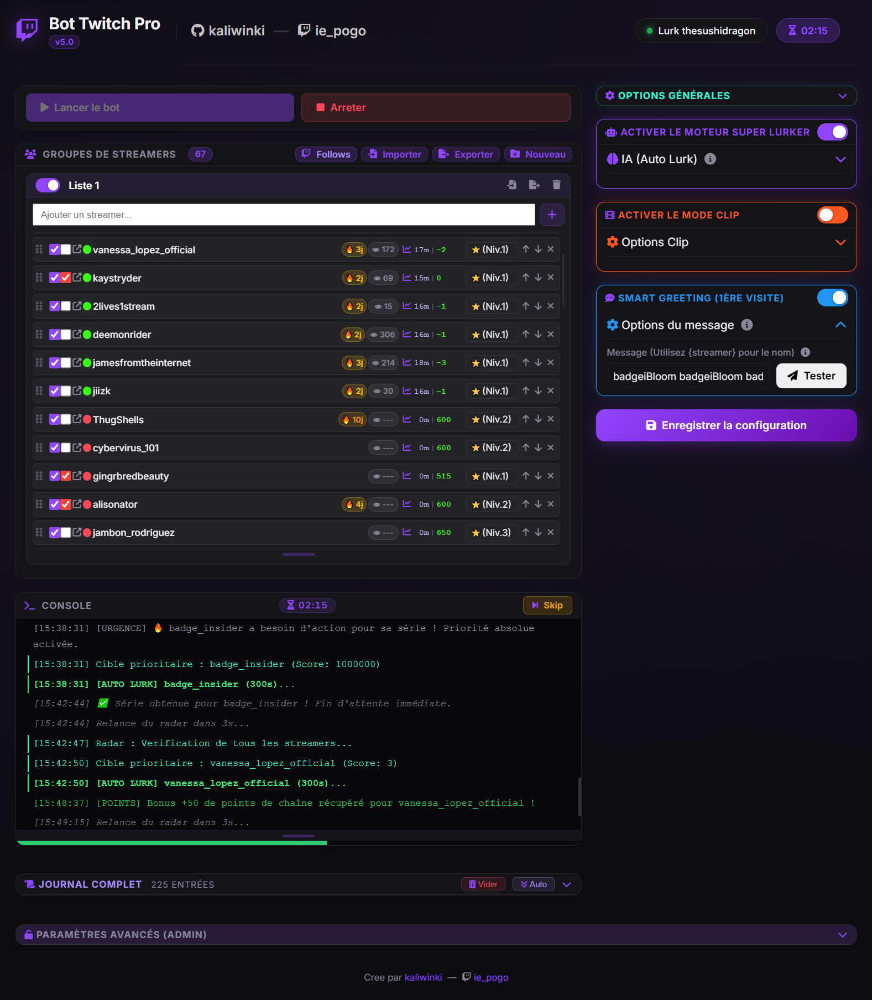
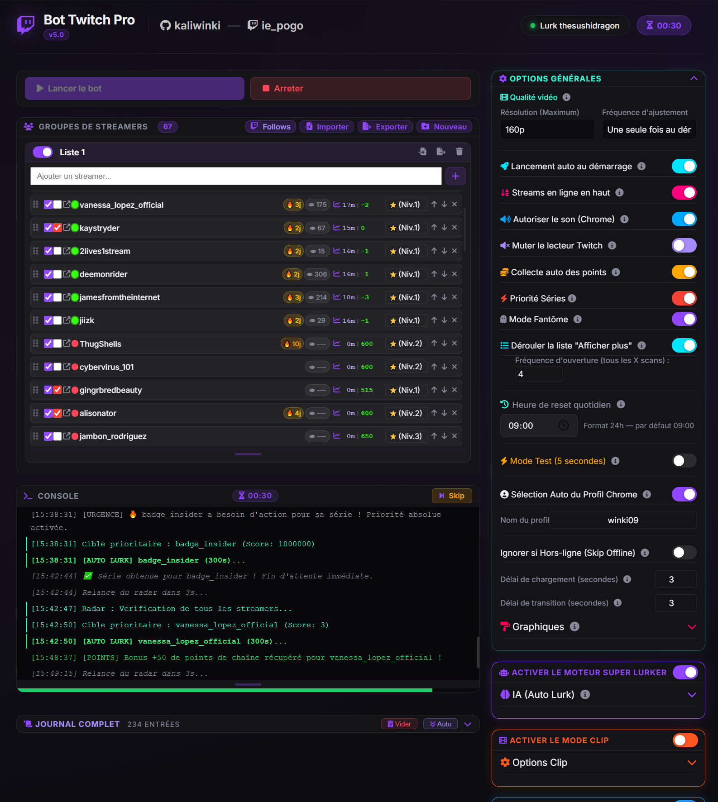
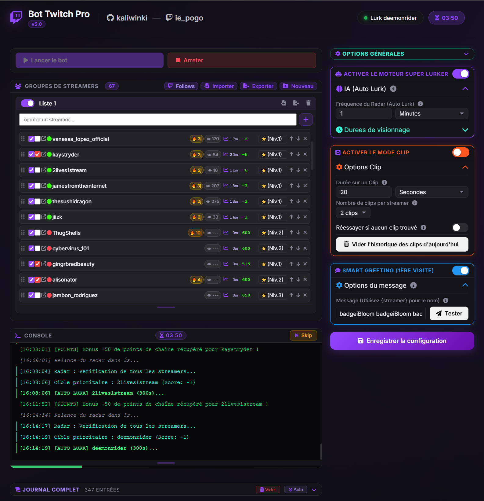
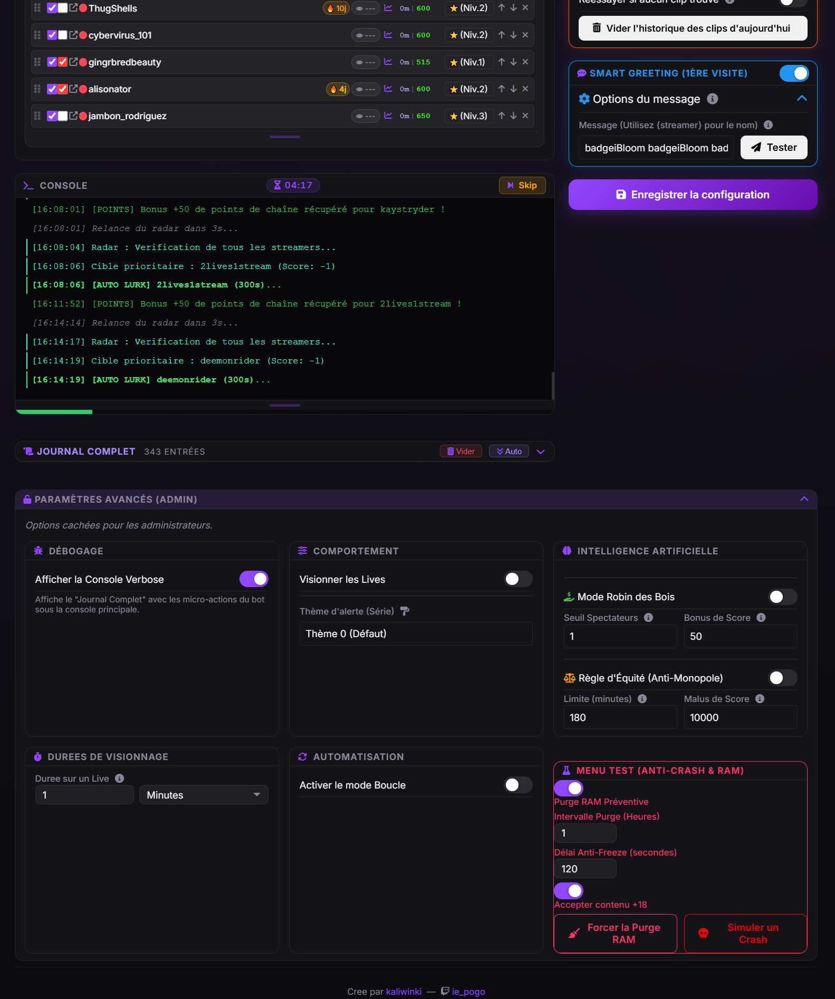

<div align="center">
  <h1>🚀 Super Lurker - Le Bot Automatique Ultime pour Twitch</h1>
  <p><b>Le couteau suisse du "Lurking" : Mode Fantôme, Score IA, Radar GQL et Anti-Détection avancée.</b></p>
  
  [](https://www.python.org/)
  [](https://flask.palletsprojects.com/)
  [](https://github.com/ultrafunkamsterdam/undetected-chromedriver)
</div>

---

**Super Lurker** est une application locale d'automatisation de visionnage (Lurk) pour Twitch, pilotée par un tableau de bord web interactif. Conçu pour contourner les protections anti-bots grâce à `undetected-chromedriver` et à la simulation de comportements humains, ce bot gère de manière autonome vos visionnages pour faire gagner du temps de vue, récolter des points de chaîne et interagir intelligemment.

## 📸 Aperçu

| Tableau de bord Principal | Paramètres Généraux |
|:---:|:---:|
|  |  |

| Menu Bot, Clip, et Chat | Options Avancées et Développement |
|:---:|:---:|
|  |  |

---

## 🌟 Fonctionnalités Principales (Toutes les options)

Ce bot ne se contente pas d'ouvrir des pages. Il analyse, réfléchit et priorise vos streamers.

### 🧠 Moteur de Décision IA & Réflection
- **Radar GQL Intelligent** : Le bot communique directement avec l'API GraphQL cachée de Twitch pour vérifier qui est en ligne instantanément, *sans avoir à ouvrir le navigateur*.
- **Gestion des Priorités (Niveaux 1 à 10)** : Vous pouvez classer vos streamers par ordre d'importance (de 1 à "DIEU"). Le bot allouera son temps de visionnage de manière asymétrique en fonction du rang.
- **Règle d'Équité (Anti-Monopole) ⚖️** : Si un streamer accapare le bot pendant trop longtemps (ex: + de 180 minutes dans la journée), le bot lui applique un "malus" de score pour laisser la chance aux autres streamers en attente.
- **Mode Robin des Bois 🏹** : Option activable pour soutenir automatiquement les petits créateurs. Le bot vérifie le nombre de spectateurs en direct (via l'API Decapi) et accorde un énorme bonus de priorité aux chaînes qui ont moins de X spectateurs.
- **Priorité Absolue (Streaks / Flammes) 🔥** : Le bot ouvre le menu latéral de Twitch pour lire vos "séries de visionnage". S'il détecte qu'une chaîne a besoin d'être regardée aujourd'hui pour sauver votre série, il écrase toutes les règles pour visionner cette chaîne en urgence.

### 👻 Mode Fantôme & Anti-Détection
- **Mouvements Humains (Ghost Mode)** : Le bot simule aléatoirement des mouvements de souris et des défilements de page (scroll) pour prouver à Twitch que vous êtes humain.
- **Undetected Chromedriver** : Le bot bypass les protections anti-automatisations de base (reCAPTCHA, Cloudflare).
- **Mute et Qualité Vidéo Natifs** : Plutôt que de forcer la coupure du son global, le bot interagit avec le lecteur Twitch en Javascript pour le mettre en silencieux et baisser la résolution vidéo à 160p (afin de préserver votre bande passante).
- **Utilisation de Profil Chrome** : Au lieu de vous reconnecter à chaque fois, le bot peut utiliser votre véritable profil Google Chrome local. Vous gardez vos cookies, vos sessions et votre historique de navigation intacts.

### 🤖 Actions Automatisées
- **Auto-Lurk Infini** : Vous pouvez configurer le bot pour tourner en boucle (Mode Infini) ou faire des pauses entre les cycles (ex: pause de 12 heures).
- **Mode Scavenger (Clips) & Farming de Badges ♻️🌸** : Lorsqu'aucun de vos streamers n'est en ligne, le bot bascule sur les VODs et les Clips. Cette option a été spécifiquement créée pour **farmer les badges spéciaux Twitch (ex: le Badge Fleur)** qui exigent de visionner une chaîne 3 jours par semaine pendant 4 semaines consécutives. Vous pouvez simplement ajouter de nouveaux streamers à la liste de clips pour être dans les premiers à débloquer leurs futurs badges !
- **Récupérateur de Points de Chaîne 🎁** : Le bot scanne régulièrement le DOM pour repérer et cliquer instantanément sur les coffres verts bonus.
- **Salutations Intelligentes (Greeting) 💬** : Une fois par jour (réinitialisation à une heure fixe configurable), le bot peut dire Bonjour (ex: "Lurker du jour, bonjour !") quand il arrive sur un live. **Safe Check inclus** : Le bot vérifie que le chat n'est pas en "Follower-only" avec un délai supérieur à votre temps de follow pour éviter de planter ou de se faire ban.

### 🛠️ Outils de Débogage et Interface
- **Tableau de Bord Flask (UI Moderne)** : Une page web locale sombre (Dark Mode), en Glassmorphism, qui vous permet de voir ce que fait le bot en temps réel (Timer, Streamer en cours, Logs).
- **Console Verbose (Journal Exhaustif)** : Une console cachée dans les options admin permet de traquer chaque micro-action. Le bot logue chaque réflexion de l'IA (`[RÉFLEXION/ÉQUITÉ]`), chaque requête API et chaque élément trouvé ou manquant dans le DOM. 
- **Persistance des Logs (Zéro RAM)** : Pour éviter le crash du navigateur après 12 heures, la console web est cappée à 1000 entrées, mais **le bot écrit l'historique infini sur votre disque dur** (`debug_journal.log`).

---

## ⚙️ Installation & Lancement

### Prérequis
- Windows 10/11
- [Python 3.8+](https://www.python.org/downloads/)
- Google Chrome (installé sur le chemin par défaut de Windows)

### Étapes
1. Clonez ou téléchargez ce répertoire.
2. Ouvrez une invite de commande (Terminal / PowerShell) dans ce dossier.
3. Installez les dépendances Python via le fichier `requirements.txt` :
   ```bash
   pip install -r requirements.txt
   ```
4. Lancez l'application en double-cliquant sur **`Start_Dashboard.bat`**.
5. Votre navigateur par défaut s'ouvrira automatiquement sur l'adresse locale `http://127.0.0.1:5000`.

---

## 📖 Comment ça marche ? (Mode d'emploi express)
1. **Ajouter des Streamers** : Tapez le pseudo Twitch dans l'interface et assignez une priorité (de 1 à DIEU).
2. **Options** : Déroulez les panneaux pour ajuster le temps de visionnage par priorité, ou activer le Mode Robin des Bois.
3. **Démarrer** : Cliquez sur le gros bouton vert "Démarrer le Bot". Une nouvelle fenêtre Chrome s'ouvre, c'est le bot ! Laissez cette fenêtre en arrière-plan.
4. **Surveiller** : Regardez la progression directement depuis la Console du tableau de bord.

## 🤝 Contribution et Mentions Légales
Ce projet a été développé à des fins d'apprentissage en automatisation Selenium et Flask.
L'automatisation du visionnage sur Twitch peut aller à l'encontre des Conditions d'Utilisation (TOS) de la plateforme. Utilisez ce logiciel avec prudence, à vos propres risques, et sans en faire un usage abusif (spam, fake views).

*Créé avec l'aide d'Antigravity.*
